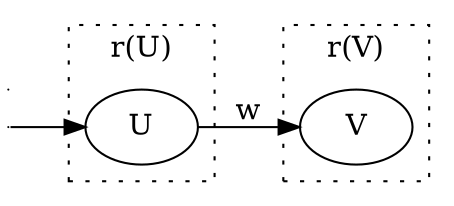
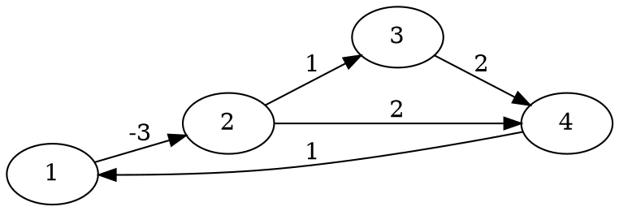

# NCKU DSP Arch NOTE
contributed by <[`yanjiun`](https://github.com/yanjiunhaha)>
###### tags: `mynote`
課程：[VLSI design for digital communication systems -N2109 of NCKU](http://vlsilab.ee.ncku.edu.tw/vlsi.html)
學生：顏君翰 MS student
指導老師：[謝明德](http://vlsilab.ee.ncku.edu.tw/prof.html) PhD

## Retiming (請假)
* 目標：
    * Clock period miniretiming
    * Registers minimization
### Demo
:::warning
待補充
:::
#### Clock period constrains
#### Registers minimization

### Definations
* $G$: Original DFG, $G_r$: Retimed DFG
* $r(V)$: Delay transferred from outgoing edges of node V to the incident deges of node V.

* $w(e)$: weigth(delay) of the edge $e$
* $w_r(e)$: weight(delay) of the dege $e$ after retiming.
* $U \xrightarrow{w_r(e)} V$ after retiming has a weight of $w_r(e)=w(e)+r(V)-r(U)$
    * 因為當前的個數 $w(e)$ 加上前面拿入的 $r(V)$ 減去拿出到後面的 $r(U)$
* weighty of path 
  $w(p)=\sum_{i=0}^{k-1}w(e_i)$
  
* path computaion time
  $t(p)=\sum_{i_0}^{k}t(V_i)$
  
#### Minimium clock period
* $\Phi(G)=max\{t(p):w(p)=0\}$
* $W(U,V)=min\{w(p):U\xrightarrow{p}V\}$
    * Minimum number of registers on any path from node U to node V
* $D(U,V)=max\{t(p):U\xrightarrow{p}V\ and\ w(p)=W(U,V)\}$
    * Maximum computation time among all paths from U to V with weight $W(U,V)$

* $M=t_{max}n$
    * $t_max$:max node computation time
    * $n$: number of nodes
* $w'(e)=Mw(e)-t(U)$
    * for all edges to create new graph $G'$
* $S'_{UV}$: Solve shortest path problem on $G'$
    * $If\ U \ne V\ then$
      $W(U,V)=\lceil{\frac{S'_UV}{M}}\rceil$
      $D(U,V)=MW(U,V)-S'_{UV}+t(V)$
    * $If\ U = V\ then$
      $W(U,V)=0$
      $D(U,V)=t(U)$
#### Minimium registers 
* $R_v=\max_{V\xrightarrow{e}?}\{w_r(e)\}$
### 特性
* Retiming dose not alter the iteration bound in a DFG

### 介紹
forward cutsets retiming(pipeline) < cutsets retiming < retiming
* Retiming

* Cutset retiming rules
  
* forward cutsets retiming(pipeline)
  

### $N-slow$ DFG
==Replace each delay in a DFG with N delays.==

* Retiming 2-slow Graph

## Shortest Path Algorithm
### Floyd-Warshall algorithm
==如果沒有*負圈*，就會找到最短路徑==

1. Initial frist matrix by DFG
   $R^{(1)}=
\begin{bmatrix}
    \infty &   -3   & \infty & \infty \\
    \infty & \infty &    1   & \infty \\
    \infty & \infty & \infty &    2   \\
       1   & \infty & \infty & \infty
\end{bmatrix}$

* if $k^{(k+1)}(U,V)>r^k(U,k)+r^k(k,V)$
2. $R^{(2)}=
\begin{bmatrix}
    \infty & -3 & \infty & \infty\\
    \infty & \infty & 1 & 2 \\
    \infty & \infty & \infty & 2\\
    1 & -2 & \infty & \infty &
\end{bmatrix}$

* if $k^{(k+1)}(U,V)>r^k(U,k)+r^k(k,V)$
3. $R^{(3)}=
\begin{bmatrix}
    \infty & -3 & -2 & -1\\
    \infty & \infty & 1 & 2\\
    \infty & \infty & \infty & 2\\
    1 & -2 & -1 & 0 &
\end{bmatrix}$

* if $k^{(k+1)}(U,V)>r^k(U,k)+r^k(k,V)$
4. $R^{(4)}=
\begin{bmatrix}
    \infty & -3 & -2 & -1\\
    \infty & \infty & 1 & 2\\
    \infty & \infty & \infty & 2\\
    1 & -2 & -1 & 0 &
\end{bmatrix}$

* if $k^{(k+1)}(U,V)>r^k(U,k)+r^k(k,V)$
5. $R^{(5)}=
\begin{bmatrix}
    0 & -3 & -2 & -1\\
    3 & 0 & 1 & 2\\
    3 & 0 & 1 & 2\\
    1 & -2 & -1 & 0 &
\end{bmatrix}$

